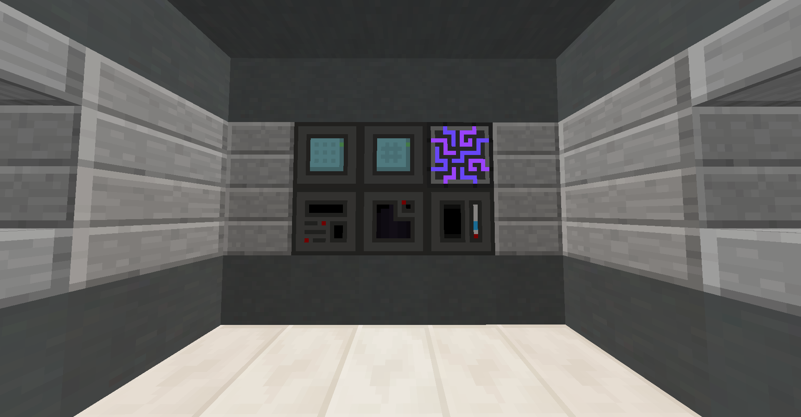
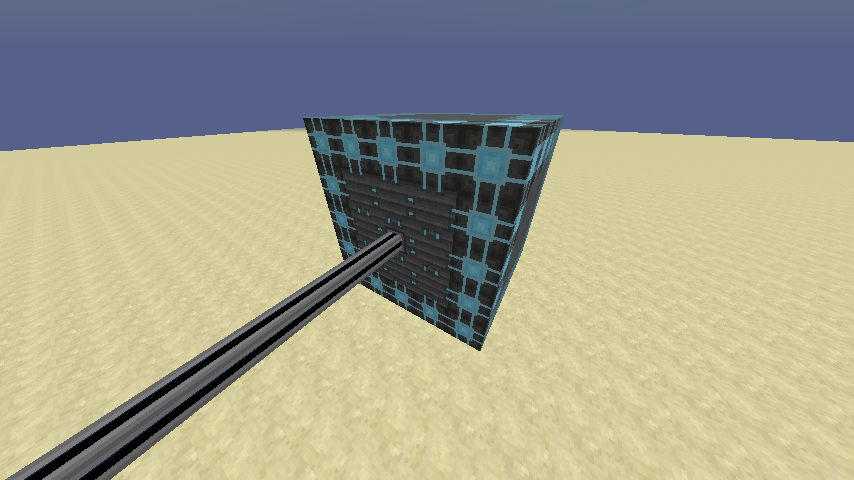

# Lazy AE2 #

*AE2 for people who hate microcrafting*

**Lazy AE2** adds a few more Applied Energistics machines that help speed up certain operations. It was designed with the intent of creating alternate channels for automating AE2's in-world crafting mechanisms, which had a tendency to clash with lag-clearing tools.





## New Features

* **Fluix Aggregator** - Performs the in-world fluix crystal crafting operation
* **Pulse Centrifuge** - Performs the in-world crystal seed growing operation
* **ME Circuit Etcher** - Etches circuits without needing to waste time pressing the components
* **Crystal Energizer** - Charges certus quartz more efficiently than the AE2 charger
* **Preemptive Assembly Unit** - Alternative to the ME interface that dispatches crafting operations eagerly
    *   Instead of dispatching a recipe one-at-a-time, as much of the recipe's inputs are dumped into the processing machine as possible
    *   Useful for when you're late-game and your processing machines process faster than ME interfaces can provide ingredients
* **ME Level Maintainer** - Maintains a quantity of certain items in an ME network by requesting autocrafting when needed
* **Mass Assembly Chamber** - A really big multi-block molecular assembler. Goes fast and holds lots of patterns!

Everything is JEI-integrated, so you won't have to waste time guessing at recipes.

## Required Dependencies

*   [Applied Energistics 2](https://minecraft.curseforge.com/projects/applied-energistics-2) ([source](https://github.com/AppliedEnergistics/Applied-Energistics-2))
*   [LibNine](https://minecraft.curseforge.com/projects/libnine) ([source](https://github.com/phantamanta44/libnine))

## CraftTweaker Support

Recipes for the processing machines can be modified as follows:

```zenscript
// add aggregator recipe
// addRecipe(ItemStack output, ItemMatcher input1, ItemMatcher input2, [ItemMatcher input3])
mods.threng.Aggregator.addRecipe(<minecraft:diamond>, <minecraft:dirt>, <ore:dustGlowstone>, <minecraft:coal:1>);

// remove aggregator recipe
// removeRecipe(ItemStack output)
mods.threng.Aggregator.removeRecipe(<threng:material:0>);

// add centrifuge recipe
// addRecipe(ItemStack output, ItemMatcher input)
mods.threng.Centrifuge.addRecipe(<minecraft:diamond>, <minecraft:diamond_ore>);

// remove centrifuge recipe
// removeRecipe(ItemStack output)
mods.threng.Centrifuge.removeRecipe(<appliedenergistics2:material:10>);

// add etcher recipe
// if top and bottom inputs aren't specified, redstone and silicon are used
// note that the items that are allowed in each slot is determined by the recipes
// DO NOT USE ANY ITEM IN MORE THAN ONE DIFFERENT SLOT OR THIS WILL BREAK!
// addRecipe(ItemStack output, ItemMatcher input, [ItemMatcher topInput, ItemMatcher bottomInput])
mods.threng.Etcher.addRecipe(<minecraft:diamond>, <minecraft:dirt>, <minecraft:stick>, <minecraft:cobblestone>);

// remove etcher recipe
// removeRecipe(ItemStack output)
mods.threng.Etcher.removeRecipe(<appliedenergistics2:material:22>);

// add energizer recipe
// addRecipe(ItemStack output, ItemMatcher input, int energyCost)
mods.threng.Energizer.addRecipe(<minecraft:gold_ingot>, <minecraft:iron_ingot>, 24000);

// remove energizer recipe
// removeRecipe(ItemStack output)
mods.threng.Energizer.removeRecipe(<appliedenergistics2:material:10>);
```
